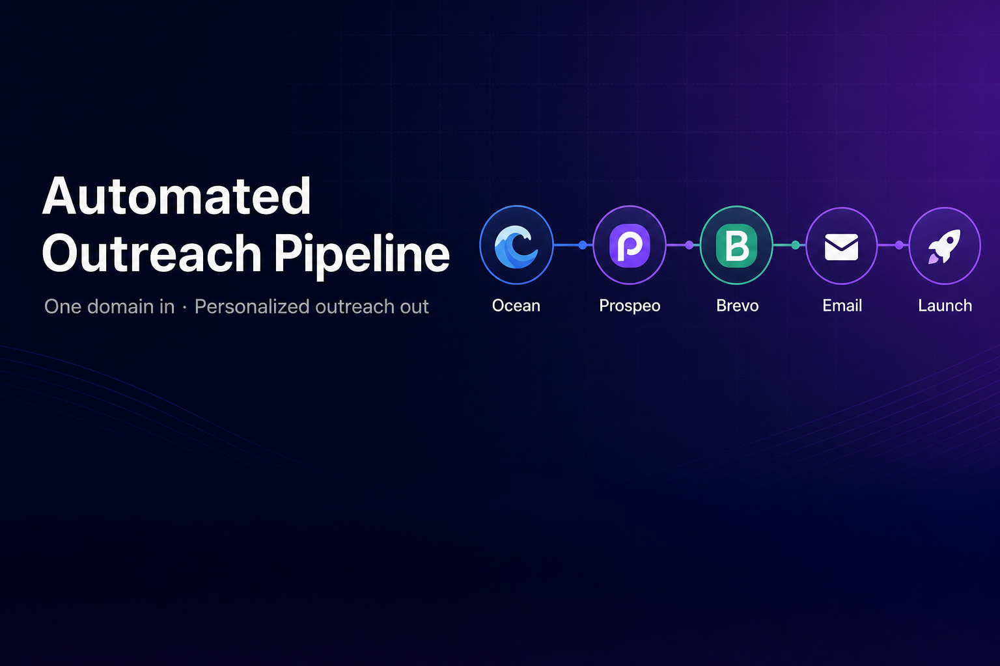
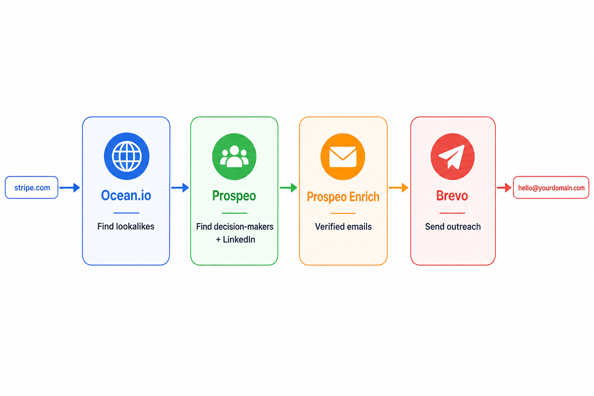
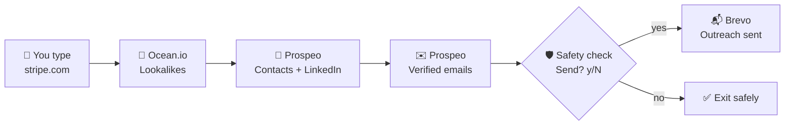

<div align="center">



# 🚀 Automated Outreach Pipeline

**One domain in. Personalized outreach out. Zero copy-paste energy required.** ✨

[](https://python.org)
[](https://github.com/sereenat7/automated-outreach-pipeline)
[](https://brevo.com)
[](https://sereena.live)

*Built by [Sereena Thomas](https://github.com/sereenat7) · SDE Intern Take-Home · Vocallabs / Subspace*

[Quick Start](#-quick-start) ·
[How It Works](#-how-it-works) ·
[Usage](#-usage) ·
[Demo Output](#-demo-output) ·
[Project Structure](#-project-structure)

</div>

---

## 🎯 What's the vibe?

You know that feeling when you're doing cold outreach and you're bouncing between **5 tabs**, copying domains, hunting LinkedIn profiles, guessing emails, and praying you don't hit send on the wrong person? 😮‍💨

Yeah. This project kills that.

Give it **one company domain** you already like — say `stripe.com` — and it automatically:

| Step | What happens |
|------|----------------|
| 🔍 **Discover** | Finds lookalike companies (Ocean.io) |
| 👔 **Identify** | Surfaces C-suite & VP decision-makers + LinkedIn |
| 📧 **Verify** | Resolves real, verified work emails (Prospeo) |
| 🛡️ **Confirm** | Shows you everything before a single email fires |
| 📬 **Send** | Delivers personalized outreach from your domain (Brevo) |

> 💡 **One input. Full pipeline. No human handoffs.** That's the whole assignment — and it's what companies actually pay for.

---

## 🗺️ How It Works





| Stage | API | You get |
|-------|-----|---------|
| 1️⃣ | **Ocean.io** | Similar company domains |
| 2️⃣ | **Prospeo** | Decision-makers + LinkedIn URLs |
| 3️⃣ | **Prospeo** | Verified work emails |
| 4️⃣ | **Brevo** | Personalized emails from `hello@sereena.live` |

> 📌 Original brief mentioned Eazyreach — official FAQ says **use Prospeo for emails too**. Less tools, same result. We're built for that. ✅

---

## ✨ Features

- 🧩 **Modular stages** — each API is its own clean module
- 🛡️ **Safety first** — nothing sends until *you* say yes
- 🧪 **Dry-run mode** — test everything without emailing real humans
- 🔁 **Rate-limit proof** — backoff + single-enrich fallback for Prospeo free tier
- 📊 **Pretty CLI** — Rich tables with company, contact, title, LinkedIn, email
- 🎨 **Personalized copy** — emails use name, company, and job title
- 🔐 **Idempotent sends** — no accidental double-emails on retry

---

## ⚡ Quick Start

### You need

| Thing | Why |
|-------|-----|
| 🐍 Python 3.10+ | Run the CLI |
| 🌐 Your own domain | Required for the assignment (sending credibility) |
| 🔑 3 API keys | Ocean.io · Prospeo · Brevo |

### Install in 60 seconds

```bash
# 1. Clone it
git clone https://github.com/sereenat7/automated-outreach-pipeline.git
cd automated-outreach-pipeline

# 2. Virtual env (trust me, do this)
python3 -m venv .venv
source .venv/bin/activate

# 3. Dependencies
pip install -r requirements.txt

# 4. Your secrets (never commit this!)
cp .env.example .env
```

### Fill in `.env`

```env
OCEAN_API_KEY=your_ocean_token
PROSPEO_API_KEY=your_prospeo_key
BREVO_API_KEY=your_brevo_key

SENDER_EMAIL=hello@yourdomain.com
SENDER_NAME=Your Name
```

### First run (safe mode 🧪)

```bash
python main.py stripe.com --limit 5 --dry-run
```

No emails sent. Full pipeline. Perfect for your first vibe check. 😌

---

## 🖥️ Usage

```bash
# 🏃 Full run (25 companies, with safety prompt)
python main.py stripe.com

# 💰 Save API credits
python main.py stripe.com --limit 10

# 🧪 Test without sending
python main.py stripe.com --dry-run

# ⚡ Skip prompt (only when you're 100% sure)
python main.py stripe.com --yes
```

| Flag | What it does |
|------|--------------|
| `domain` | Seed company, e.g. `stripe.com`, `shopify.com` |
| `--limit N` | Max lookalike companies (default: 25) |
| `--dry-run` | Run everything except Brevo send |
| `--yes` | Auto-confirm send (use carefully) |

---

## 📺 Demo Output

This is what a successful run looks like:

```
Automated Outreach Pipeline
Seed domain: stripe.com

→ Finding lookalike companies for stripe.com...
→ Found 5 lookalike companies.
→ Finding decision-makers...
→ Found 5 decision-makers.
→ Resolving verified work emails...
→ Resolved 4 verified emails.

                              Outreach Summary
┏━━━━━━━━━━━━━━━┳━━━━━━━━━━━━━━━┳━━━━━━━━━━━━━━━┳━━━━━━━━━━━━━━━┳━━━━━━━━━━━━━━┓
┃ Company       ┃ Contact       ┃ Title         ┃ LinkedIn      ┃ Email        ┃
┡━━━━━━━━━━━━━━━╇━━━━━━━━━━━━━━━╇━━━━━━━━━━━━━━━╇━━━━━━━━━━━━━━━╇━━━━━━━━━━━━━━┩
│ Razorpay      │ Apoorv Kakar  │ GTM Associate │ https://...   │ apoorv@...   │
│ Cashfree      │ Parveen Kumar │ SVP           │ https://...   │ parveen@...  │
└───────────────┴───────────────┴───────────────┴───────────────┴──────────────┘

Ready to send 4 email(s). Proceed? [y/N]: y
→ Sending 4 outreach emails...
✓ Sent to Parveen Kumar <parveen.kumar@cashfree.com>
```

Track sent emails in **Brevo → Transactional → Email → Logs** 📋

---

## 🛡️ Safety Checkpoint

We're not about surprise blasts. Before any email goes out:

1. 📊 Full summary table prints
2. ❓ You get asked: `Ready to send N email(s). Proceed? [y/N]:`
3. 🚫 Default is **No** — hit Enter and nothing sends

Your reputation > automation speed. Always. 💅

---

## 📁 Project Structure

```
automated-outreach-pipeline/
├── 🎬 main.py              # CLI boss — runs the whole show
├── ⚙️  config.py            # Env vars & limits
├── 📦 models.py            # Company & Contact models
├── stages/
│   ├── 🌊 ocean.py         # Stage 1: lookalike search
│   ├── 🔎 prospeo.py       # Stage 2 & 3: contacts + emails
│   └── 📬 brevo.py         # Stage 4: send outreach
├── templates/
│   └── ✍️  email.html       # Your outreach copy
├── utils/
│   ├── 🌐 http.py          # Retry & backoff magic
│   └── 📝 logging.py       # Pretty terminal output
└── assets/
    ├── banner.png          # README header
    └── pipeline-diagram.png
```

---

## 🔧 Under the Hood

<details>
<summary><b>🌊 Stage 1 — Ocean.io</b></summary>

- `POST /v3/search/companies`
- Input: seed domain → Output: lookalike company domains
- Strips `https://`, `www.`, deduplicates results

</details>

<details>
<summary><b>🔎 Stage 2 — Prospeo Search</b></summary>

- `POST /search-person`
- Filters: C-Suite, VP, Founder/Owner
- 1 decision-maker per company + LinkedIn URL

</details>

<details>
<summary><b>✉️ Stage 3 — Prospeo Enrich</b></summary>

- `POST /bulk-enrich-person` → fallback to `/enrich-person`
- Only keeps **VERIFIED** emails
- Handles free-tier rate limits (1 req/sec) gracefully

</details>

<details>
<summary><b>📬 Stage 4 — Brevo</b></summary>

- `POST /v3/smtp/email`
- HTML + plain-text personalized emails
- Sends from verified domain with idempotency keys

</details>

---

## 💳 API Credits (real talk)

| Service | ~Cost per 25-company run |
|---------|--------------------------|
| 🌊 Ocean.io | ~5 credits |
| 🔎 Prospeo search | ~1 credit/page |
| ✉️ Prospeo enrich | ~1 credit/email |
| 📬 Brevo | 1 send each (300/day free) |

**Pro tip:** Start with `--limit 5 --dry-run` so you don't burn credits on day one. 🧠

---

## 🚨 Error Handling

| Situation | Pipeline says |
|-----------|---------------|
| No lookalikes found | "Try a different seed domain" |
| No contacts found | Warns & exits cleanly |
| No verified email | Skips contact, keeps going |
| Rate limit (429) | Waits, retries, falls back |
| Low Ocean credits | Stops with clear message |
| Brevo send fails | Logs it, continues the rest |

Messy data happens. The pipeline doesn't crash — it adapts. 💪

---

## 🌐 Domain Setup

This assignment **requires** your own domain. Here's the flow:

```
Buy domain → Authenticate on Brevo → Add sender → Put in .env → Ship it 🚢
```

| Setting | Example |
|---------|---------|
| Domain | `sereena.live` |
| Sender | `hello@sereena.live` |
| Brevo status | ✅ Authenticated (SPF, DKIM, DMARC) |

---

## 🧰 Tech Stack


---

## 👩‍💻 Author

<div align="center">

**Sereena Thomas**

SDE Intern · Vocallabs / Subspace

[](https://github.com/sereenat7)
[](https://sereena.live)
[](mailto:hello@sereena.live)

*If this README helped you, star the repo — it fuels the pipeline. ⭐*

</div>

---

<div align="center">

**Built with ☕, Python, and a healthy fear of sending emails to the wrong person.**

`python main.py your-favorite-startup.com --dry-run` 👈 start here

</div>
